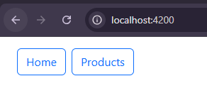
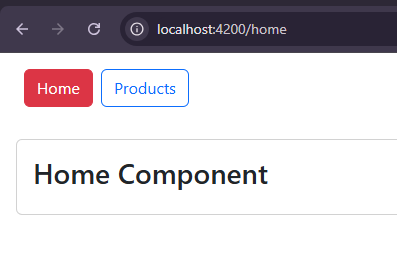
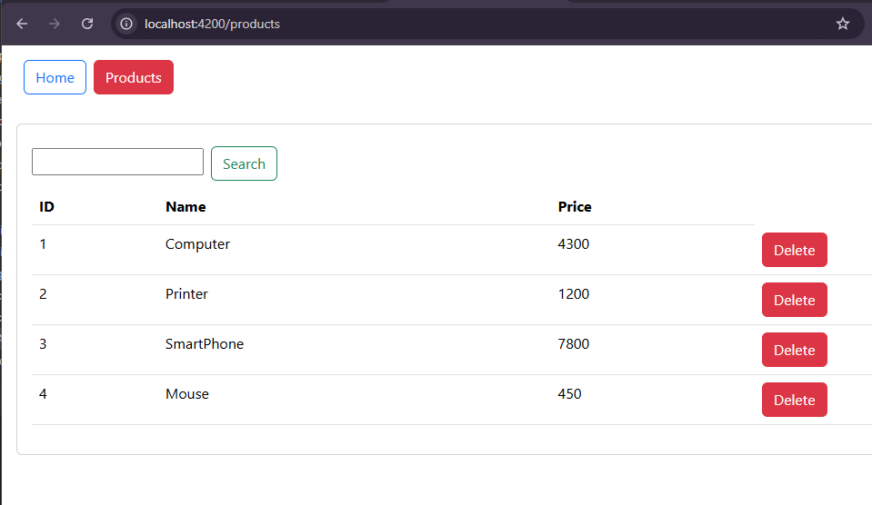
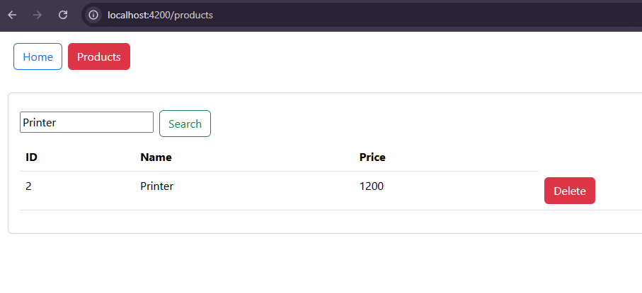
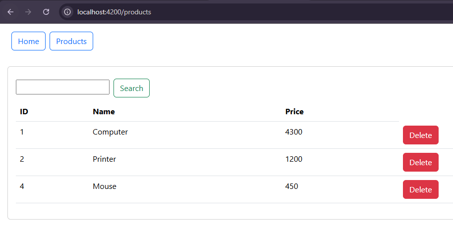

<h1>Gestion des Produits avec Angular</h1>

Ce projet est une démonstration pour découvrir Angular, avec des fonctionnalités telles que la navigation, la recherche et la suppression d'éléments.

<h2>Page de démarrage</h2>

<h2>Page d'Accueil</h2>
  

<h2>Page des Produits</h2>
<h3>Affichage des Produits</h3>
  

<h3>Recherche</h3>
  

<h3>Suppression</h3>
  

<h3>Auteur</h3>

Réalisé par : Rahhali Asmaa

